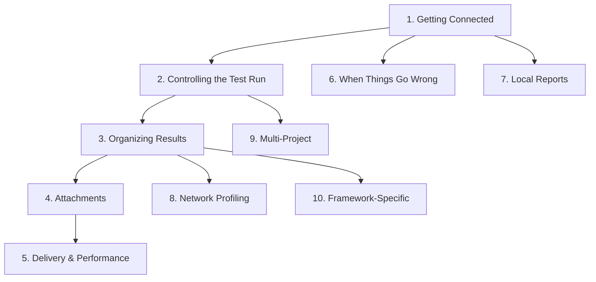

The previous categorization ("what does the option influence") was system-oriented. Here's a reorganization based on how users actually think when configuring a reporter — structured around the decisions they make, in the order they make them.

***

# Configuration Options — Organized by User Decision

## 1. Getting Connected

_"What do I need to make this work?"_

These are the options a user touches on day one. Three of them are required; the rest have sensible defaults.

| #  | Option              | Config Key               | Env Var                       | Default   | Required                | Platforms |                                             |
| :- | :------------------ | :----------------------- | :---------------------------- | :-------- | :---------------------- | :-------- | :------------------------------------------ |
| 1  | **Mode**            | `mode`                   | `QASE_MODE`                   | `off`     | Yes                     | All       |                                             |
| 2  | **API token**       | `testops.api.token`      | `QASE_TESTOPS_API_TOKEN`      | —         | Yes (in `testops` mode) | All       |                                             |
| 3  | **Project code**    | `testops.project`        | `QASE_TESTOPS_PROJECT`        | —         | Yes (in `testops` mode) | All       |                                             |
| 4  | **API host**        | `testops.api.host`       | `QASE_TESTOPS_API_HOST`       | `qase.io` | Only for enterprise     | All       |                                             |
| 5  | **Enterprise flag** | `testops.api.enterprise` | `QASE_TESTOPS_API_ENTERPRISE` | `false`   | Only for enterprise     | JV, CS    | [7-cite-0](#7-cite-0) [7-cite-1](#7-cite-1) |

**Why this group exists**: Every user starts here. If these are wrong, nothing else matters. The documentation should present these first and make it clear that options 1–3 are the only ones needed to get results flowing.

***

## 2. Controlling the Test Run

_"Where do my results land, and what does the run look like?"_

Once connected, the next question is always about the test run. Does the reporter create one? Do I reuse an existing one? What's it called? When does it close?

| #  | Option                      | Config Key                     | Env Var                                | Default                     | Platforms           | Notes                                                     |                                             |
| :- | :-------------------------- | :----------------------------- | :------------------------------------- | :-------------------------- | :------------------ | :-------------------------------------------------------- | :------------------------------------------ |
| 6  | **Run ID**                  | `testops.run.id`               | `QASE_TESTOPS_RUN_ID`                  | —                           | All                 | Use an existing run. **Required in Go** (no auto-create). |                                             |
| 7  | **Run title**               | `testops.run.title`            | `QASE_TESTOPS_RUN_TITLE`               | `Automated Run {timestamp}` | JS, PY, JV, CS, PHP | Title for auto-created runs.                              |                                             |
| 8  | **Run description**         | `testops.run.description`      | `QASE_TESTOPS_RUN_DESCRIPTION`         | —                           | JS, PY, JV, CS, PHP |                                                           |                                             |
| 9  | **Auto-complete run**       | `testops.run.complete`         | `QASE_TESTOPS_RUN_COMPLETE`            | `true`                      | JS, PY, JV, CS, PHP | Set to `false` for mixed manual+automated runs.           |                                             |
| 10 | **Plan ID**                 | `testops.plan.id`              | `QASE_TESTOPS_PLAN_ID`                 | —                           | JS, PY, JV, CS, PHP | Creates the run from a Test Plan. Includes manual cases.  |                                             |
| 11 | **Run tags**                | `testops.run.tags`             | `QASE_TESTOPS_RUN_TAGS`                | —                           | JS, PY, JV, CS, PHP | Comma-separated.                                          |                                             |
| 12 | **External link**           | `testops.run.externalLink`     | `QASE_TESTOPS_RUN_EXTERNAL_LINK`       | —                           | JS, JV              | Link to Jira ticket, PR, etc.                             |                                             |
| 13 | **Show public report link** | `testops.showPublicReportLink` | `QASE_TESTOPS_SHOW_PUBLIC_REPORT_LINK` | `false`                     | JS, PY, JV, CS, PHP | Enables public URL and prints it to console.              | [7-cite-2](#7-cite-2) [7-cite-3](#7-cite-3) |

**Why this group exists**: The test run is the container users see in the Qase UI. These options control what that container looks like and how it behaves. The critical decision here is whether to auto-create a run (default) or attach to an existing one — and whether to auto-complete it or leave it open for manual testers.

***

## 3. Organizing & Enriching Results

_"How do my results appear in Qase?"_

These options control the metadata and structure attached to each result. They don't change what tests run — they change how results are categorized and displayed.

| #  | Option                         | Config Key                                 | Env Var                                            | Default | Platforms           | Notes                                                                                    |                                             |
| :- | :----------------------------- | :----------------------------------------- | :------------------------------------------------- | :------ | :------------------ | :--------------------------------------------------------------------------------------- | :------------------------------------------ |
| 14 | **Environment**                | `environment`                              | `QASE_ENVIRONMENT`                                 | —       | All                 | Environment slug (e.g., `staging`, `production`). Applied to the run.                    |                                             |
| 15 | **Root suite**                 | `rootSuite`                                | `QASE_ROOT_SUITE`                                  | —       | JS, PY, JV, CS, PHP | Prepends a parent suite to all results. Useful for grouping by project/module.           |                                             |
| 16 | **Status mapping**             | `statusMapping`                            | `QASE_STATUS_MAPPING`                              | —       | All                 | Remap statuses: e.g., `{"invalid": "failed"}`. Uses status slugs.                        |                                             |
| 17 | **Status filter**              | `testops.statusFilter`                     | `QASE_TESTOPS_STATUS_FILTER`                       | —       | All                 | Exclude results with specific statuses from being reported.                              |                                             |
| 18 | **Defect flag**                | `testops.defect`                           | `QASE_TESTOPS_DEFECT`                              | `false` | All                 | Auto-create defects for failed tests.                                                    |                                             |
| 19 | **Configurations**             | `testops.configurations.values`            | `QASE_TESTOPS_CONFIGURATIONS_VALUES`               | —       | JS, JV              | Key-value pairs for configuration groups (e.g., `{"os": "linux", "browser": "chrome"}`). |                                             |
| 20 | **Auto-create configurations** | `testops.configurations.createIfNotExists` | `QASE_TESTOPS_CONFIGURATIONS_CREATE_IF_NOT_EXISTS` | `false` | JS, JV              | Create configuration values in Qase if they don't exist.                                 |                                             |
| 21 | **Exclude params**             | `testops.excludeParams`                    | `QASE_TESTOPS_EXCLUDE_PARAMS`                      | —       | PY                  | Exclude specific parameter names from result signatures.                                 | [7-cite-4](#7-cite-4) [7-cite-5](#7-cite-5) |

**Why this group exists**: These are the options users reach for when results are flowing but don't look right — wrong suite hierarchy, wrong environment label, or statuses that don't match their workflow. They're the "shape the output" knobs.

***

## 4. Attachments & Artifacts

_"What files get uploaded with my results?"_

| #  | Option                          | Config Key                            | Env Var                           | Default               | Platforms       | Notes                                 |                                             |
| :- | :------------------------------ | :------------------------------------ | :-------------------------------- | :-------------------- | :-------------- | :------------------------------------ | :------------------------------------------ |
| 22 | **Upload attachments**          | `testops.uploadAttachments`           | `QASE_TESTOPS_UPLOAD_ATTACHMENTS` | `true`                | JS              | Toggle attachment uploads entirely.   |                                             |
| 23 | **Capture logs**                | `captureLogs`                         | `QASE_CAPTURE_LOGS`               | `false`               | JS, GO          | Capture stdout/stderr as attachments. |                                             |
| 24 | **Cypress: screenshots folder** | `framework.cypress.screenshotsFolder` | —                                 | `cypress/screenshots` | JS (Cypress)    | Where to find Cypress screenshots.    |                                             |
| 25 | **Cypress: videos folder**      | `framework.cypress.videosFolder`      | —                                 | `cypress/videos`      | JS (Cypress)    | Where to find Cypress videos.         |                                             |
| 26 | **Playwright video**            | `framework.playwright.video`          | —                                 | `off`                 | PY (Playwright) | `on`, `retain-on-failure`, `off`.     |                                             |
| 27 | **Playwright trace**            | `framework.playwright.trace`          | —                                 | `off`                 | PY (Playwright) | `on`, `retain-on-failure`, `off`.     |                                             |
| 28 | **Playwright output dir**       | `framework.playwright.output_dir`     | —                                 | `test-results`        | PY (Playwright) | Directory for Playwright artifacts.   |                                             |
| 29 | **pytest: capture logs**        | `framework.pytest.captureLogs`        | `QASE_PYTEST_CAPTURE_LOGS`        | `false`               | PY (pytest)     | Capture pytest log/stdout/stderr.     | [7-cite-6](#7-cite-6) [7-cite-7](#7-cite-7) |

**Why this group exists**: Attachments are the most common source of confusion ("why aren't my screenshots showing up?") and the most common performance bottleneck. Grouping them together makes it easy to find the right knob for your framework.

***

## 5. Delivery & Performance

_"How are results sent, and how do I tune throughput?"_

These options are invisible when everything works. Users only look for them when results are slow, missing, or failing in batches.

| #  | Option                    | Config Key                    | Env Var                             | Default                  | Platforms | Notes                                                                               |                                             |
| :- | :------------------------ | :---------------------------- | :---------------------------------- | :----------------------- | :-------- | :---------------------------------------------------------------------------------- | :------------------------------------------ |
| 30 | **Batch size**            | `testops.batch.size`          | `QASE_TESTOPS_BATCH_SIZE`           | 200 (100 in Go)          | All       | Results per API request. Set to `1` to isolate bad results. Java validates: 1–2000. |                                             |
| 31 | **Upload timeout (ms)**   | `testops.batch.uploadTimeout` | `QASE_TESTOPS_BATCH_UPLOAD_TIMEOUT` | `20000`                  | JV        | Max wait time per batch upload.                                                     |                                             |
| 32 | **Upload threads**        | `testops.batch.uploadThreads` | `QASE_TESTOPS_BATCH_UPLOAD_THREADS` | `5`                      | JV        | Parallel upload threads.                                                            |                                             |
| 33 | **API timeout (seconds)** | `testops.api.timeoutSeconds`  | `QASE_TESTOPS_API_TIMEOUT_SECONDS`  | `0` (OkHttp default 10s) | JV        | HTTP connect/read/write timeout.                                                    | [7-cite-8](#7-cite-8) [7-cite-9](#7-cite-9) |

**Why this group exists**: These are tuning knobs, not setup options. Most users never touch them. But when troubleshooting missing results, `batch.size = 1` is the single most useful diagnostic tool — it deserves to be findable, not buried in a flat alphabetical list.

***

## 6. When Things Go Wrong

_"How do I see what's happening? What happens if the connection fails?"_

| #  | Option              | Config Key        | Env Var                | Default               | Platforms | Notes                                                                                   |                         |
| :- | :------------------ | :---------------- | :--------------------- | :-------------------- | :-------- | :-------------------------------------------------------------------------------------- | :---------------------- |
| 34 | **Debug mode**      | `debug`           | `QASE_DEBUG`           | `false`               | All       | Logs full payloads, API requests/responses, config values.                              |                         |
| 35 | **Console logging** | `logging.console` | `QASE_LOGGING_CONSOLE` | `true`                | All       | Print reporter activity to stdout.                                                      |                         |
| 36 | **File logging**    | `logging.file`    | `QASE_LOGGING_FILE`    | `false` (PHP: `true`) | All       | Write logs to `<project-root>/logs/`.                                                   |                         |
| 37 | **Fallback mode**   | `fallback`        | `QASE_FALLBACK`        | `off`                 | All       | What to do when primary mode fails. `report` = write locally, `off` = disable silently. | [7-cite-10](#7-cite-10) |

**Why this group exists**: These options are only relevant when something is broken. Putting them in their own group means a user in "recovery mode" can find them instantly without scanning through run management or result enrichment options they don't care about right now.

***

## 7. Local Reports (Alternative to TestOps)

_"I want results on disk, not in the cloud."_

When `mode` is set to `report`, results are written to local JSON files instead of the Qase API.

| #  | Option            | Config Key                 | Env Var                         | Default               | Platforms | Notes                                |                         |
| :- | :---------------- | :------------------------- | :------------------------------ | :-------------------- | :-------- | :----------------------------------- | :---------------------- |
| 38 | **Report driver** | `report.driver`            | `QASE_REPORT_DRIVER`            | `local`               | All       | Currently only `local` is supported. |                         |
| 39 | **Report path**   | `report.connection.path`   | `QASE_REPORT_CONNECTION_PATH`   | `./build/qase-report` | All       | Directory for report output.         |                         |
| 40 | **Report format** | `report.connection.format` | `QASE_REPORT_CONNECTION_FORMAT` | `json`                | All       | Output format. `json` or `jsonp`.    | [7-cite-11](#7-cite-11) |

**Why this group exists**: Local report mode is a completely separate workflow from TestOps. Mixing these options into the TestOps groups would confuse users who are only using one mode. Keeping them separate makes the two paths visually distinct.

***

## 8. Network Profiling

_"I want HTTP request data captured with my test results."_

| #  | Option                 | Config Key                      | Env Var | Default | Platforms | Notes                                              |                                                 |
| :- | :--------------------- | :------------------------------ | :------ | :------ | :-------- | :------------------------------------------------- | :---------------------------------------------- |
| 41 | **Profilers**          | `profilers`                     | —       | —       | JS, PY    | Array of profiler names. Currently: `["network"]`. |                                                 |
| 42 | **Skip domains**       | `networkProfiler.skip_domains`  | —       | `[]`    | JS, PY    | Domains to exclude from network capture.           |                                                 |
| 43 | **Track on fail only** | `networkProfiler.track_on_fail` | —       | `false` | JS        | Only attach network logs for failed tests.         | [7-cite-12](#7-cite-12) [7-cite-13](#7-cite-13) |

***

## 9. Multi-Project Reporting

_"I need to send results to multiple Qase projects from one test suite."_

Available only in JS and Python. Requires `mode: testops_multi`.

| #  | Option                   | Config Key                              | Env Var | Default   | Platforms |
| -- | ------------------------ | --------------------------------------- | ------- | --------- | --------- |
| 44 | **Default project**      | `testops_multi.default_project`         | —       | —         | JS, PY    |
| 45 | **Project code**         | `testops_multi.projects[].project`      | —       | —         | JS, PY    |
| 46 | **Project API token**    | `testops_multi.projects[].api.token`    | —       | —         | JS, PY    |
| 47 | **Project API host**     | `testops_multi.projects[].api.host`     | —       | `qase.io` | JS, PY    |
| 48 | **Project run title**    | `testops_multi.projects[].run.title`    | —       | —         | JS, PY    |
| 49 | **Project run complete** | `testops_multi.projects[].run.complete` | —       | `true`    | JS, PY    |
| 50 | **Project environment**  | `testops_multi.projects[].environment`  | —       | —         | JS, PY    |

***

## 10. Framework-Specific Behavior

_"My framework handles certain things differently."_

These options exist because specific test frameworks have unique concepts (xfail in pytest, browser projects in Playwright) that need explicit mapping to Qase.

### JS Playwright

| #  | Option                          | Config Key                                    | Default     | Notes                                             |
| -- | ------------------------------- | --------------------------------------------- | ----------- | ------------------------------------------------- |
| 51 | **Add browser as parameter**    | `framework.playwright.browser.addAsParameter` | `false`     | Adds Playwright project name as a test parameter. |
| 52 | **Browser parameter name**      | `framework.playwright.browser.parameterName`  | `"browser"` | Custom key name for the browser parameter.        |
| 53 | **Mark retried tests as flaky** | `framework.playwright.markAsFlaky`            | `false`     | Tests that pass after retries get marked flaky.   |

### Python pytest

| #  | Option                    | Config Key                           | Env Var                          | Default   | Notes                                          |                         |
| :- | :------------------------ | :----------------------------------- | :------------------------------- | :-------- | :--------------------------------------------- | :---------------------- |
| 54 | **xfail status (failed)** | `framework.pytest.xfailStatus.xfail` | `QASE_PYTEST_XFAIL_STATUS_XFAIL` | `skipped` | Status for xfail tests that fail as expected.  |                         |
| 55 | **xfail status (passed)** | `framework.pytest.xfailStatus.xpass` | `QASE_PYTEST_XFAIL_STATUS_XPASS` | `passed`  | Status for xfail tests that unexpectedly pass. | [7-cite-14](#7-cite-14) |

### Execution Plan (Python)

| #  | Option                  | Config Key           | Default                            | Notes                                                                 |                         |
| :- | :---------------------- | :------------------- | :--------------------------------- | :-------------------------------------------------------------------- | :---------------------- |
| 56 | **Execution plan path** | `executionPlan.path` | `./build/qase-execution-plan.json` | Reserved for future use. Plans currently load from API via `plan.id`. | [7-cite-15](#7-cite-15) |

***

## Why This Structure

The previous categorization (by what the option _influences_ internally) was accurate but required the reader to already understand the reporter's architecture — the distinction between "result transformation" and "test run metadata" is meaningful to someone who has read the source, but not to someone configuring a reporter for the first time.

This structure follows the user's decision sequence:

The ordering principle: **options are grouped by when a user needs them, not by what system component they affect.** Groups 1–4 are the "happy path" from zero to rich results. Groups 5–6 are reached only when something needs tuning or fixing. Groups 7–10 are specialized paths that most users never enter.

This also means the documentation can present Groups 1–3 as "essential reading" and Groups 4–10 as "reference" — a natural split that the previous categorization couldn't support because "Reporter Lifecycle" and "Result Transformation" both contained options from different stages of the user journey.
