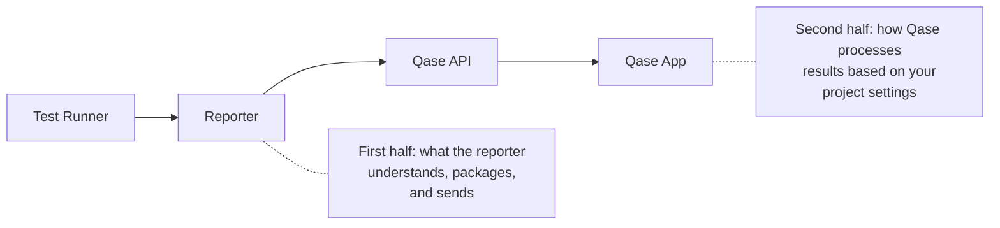

_Examples use Playwright. The behavior is the same across all reporters._

When something goes wrong with reporting, your first instinct should be to check the debug logs. Before you start guessing, before you open a support ticket — turn on debug mode and look at what the reporter is actually doing.

To understand why, it helps to know where problems can come from. There are two halves to the reporting pipeline:



A problem can live in either half. Maybe the reporter isn't sending what you think it's sending. Maybe the API is rejecting a batch because of a formatting issue. Maybe the reporter never received the test result from the runner in the first place. Debug mode gives you visibility into the first half — everything from the moment the reporter starts up to the moment the API responds. That's usually where the answer is.

One thing worth stating, even though it sounds obvious: the reporter can only report what the test runner actually executes. If a test is skipped by your framework, filtered out by a tag expression, or simply not included in the test run command, the reporter has no knowledge of it. If you're missing a result, confirm the test actually ran before looking at the reporter.

<br />

## Turn it on in CI. Keep it on.

Debug mode is verbose. In a local terminal with 20 tests, that's fine. In CI with 2,000 tests, the output can be overwhelming — thousands of lines mixed in with your framework's own output. Most people turn it off in CI to keep logs clean. That's backwards.

CI is where you need debug mode most. It's where problems are hardest to reproduce, where you can't just re-run with a flag and watch the output. The trick is to keep debug mode on but disable console logging, so the output goes only to the log file. Then save that file as a CI artifact.

```json
{
  "debug": true,
  "logging": {
    "console": false,
    "file": true
  }
}
```

This gives you the full debug output without cluttering your CI console. The reporter writes everything to a log file in a `./logs` directory — `log.txt` in JavaScript, a timestamped `.log` file in Python and Java.

<br />

### Saving the log file as a CI artifact

If you're not familiar with CI artifacts: they're files that your CI system preserves after a job finishes. Without this step, the log file is written during the job and then deleted when the runner is cleaned up. You'd have the debug data you need, but no way to access it.

In GitHub Actions, add this after your test step:

```yaml
- name: Run tests
  run: npx playwright test

- name: Save Qase debug logs
  if: always()
  uses: actions/upload-artifact@v4
  with:
    name: qase-debug-logs
    path: logs/
```

The `if: always()` is important — without it, the artifact upload is skipped when tests fail, which is exactly when you need the logs. After the job finishes, you can download the log file from the workflow run's Artifacts section in GitHub.

For other CI systems, the concept is the same: tell your CI to preserve the `logs/` directory after the job completes. In GitLab CI, that's the `artifacts.paths` key. In Jenkins, it's `archiveArtifacts`. In CircleCI, `store_artifacts`.

<br />

## What the debug log tells you

When the reporter starts, it dumps the full configuration it's operating on — every option, resolved from all three layers (config file, env vars, runtime overrides). This is the first thing to check. If the mode says `off`, or the project code is wrong, or the token is masked but clearly empty, you have your answer without reading further.

It also logs the reporter and framework versions, and the host environment (OS, language version, package manager). This is useful context when filing a support ticket.

From there, the log follows the reporter lifecycle:

* **Run creation** — did it create a new run, or connect to an existing one? What run ID?
* **Each test result** — the full JSON payload the reporter is about to send. Title, status, duration, suite, fields, parameters, step count, attachment count. This is the exact data the API will receive.
* **Batch uploads** — the reporter doesn't send results one at a time. It collects them and sends them in batches (default: 200 results per batch in most reporters). Each batch upload is logged with the count, attachment size, and the API's response.
* **API responses** — on success, you'll see the HTTP status. On failure, you'll see the status code, response headers, and the response body. This is where 401s, 422s, and 413s surface.
* **Run completion** — whether the run was completed or left open, and a summary of what was uploaded.

<br />

### Example: a healthy run

A condensed version of what you'd see for a passing Playwright run:

```
[DEBUG] qase: Config: {"mode":"testops","testops":{"api":{"token":"0e5d...a]b4","host":"qase.io"},"project":"DEMO","run":{"complete":true},"batch":{"size":200}},"debug":true}
[DEBUG] qase: Host data: {"reporter":"playwright-qase-reporter@3.0.1","framework":"@playwright/test@1.40.0","node":"v20.11.0","os":"linux"}
[INFO]  qase: Test run 4521 started
[DEBUG] qase: Result: {"title":"User can log in","execution":{"status":"passed","duration":1230},"testops_id":42,"relations":{"suite":{"data":[{"title":"Auth"},{"title":"Login"}]}}}
[DEBUG] qase: Result: {"title":"User sees error on bad password","execution":{"status":"failed","duration":890,"stacktrace":"Expected: visible..."},"testops_id":43}
[INFO]  qase: See why this test failed: https://app.qase.io/run/DEMO/dashboard/4521?status=failed
[DEBUG] qase: Sending batch of 2 results to Qase API
[DEBUG] qase: Successfully sent batch: HTTP 200
[INFO]  qase: Run 4521 completed
```

### Example: a rejected batch

```
[DEBUG] qase: Sending batch of 200 results to Qase API
[ERROR] qase: API request failed with error: 422 Unprocessable Entity
[DEBUG] qase: HTTP response body: {"errorMessage":"Invalid field value","errorFields":[{"field":"results.0.params.browser","error":"Value cannot be empty"}]}
[WARN]  qase: Batch upload failed, 200 results dropped
```

This tells you exactly which field in which result caused the rejection. In this case, an empty string parameter value — a known edge case that newer reporter versions handle automatically.

<br />

## Common scenarios

### "I don't see any results in Qase"

Open the debug log and look for:

1. **Is the mode `testops`?** The config dump at the top will tell you. If it says `off` or `report`, results aren't being sent to the API.
2. **Was a run created?** Look for "Test run X started." If you don't see this, the reporter failed to create a run — usually a token or project code issue. The error will be right there.
3. **Were results sent?** Look for "Sending batch" lines. If there are none, the reporter collected zero results. Go back to the test runner — did the tests actually execute?
4. **Did the API accept them?** Look for the HTTP status after each batch. A 200 means the API accepted the batch. Anything else means it didn't, and the response body will say why.

<br />

### "Some results are missing"

This is where batching matters. The reporter collects results as tests finish and sends them in batches. If a batch of 200 results is rejected by the API (a 422, for example), all 200 results in that batch are dropped. The other batches that succeeded are fine. So you might see 800 out of 1,000 results — meaning one batch failed.

The debug log will show you which batch failed and why. Common causes:

* **Empty parameter values** — some frameworks pass empty strings or nulls as parameter values, which the API rejects. Newer reporter versions sanitize these automatically.
* **Attachment upload failures** — if an attachment fails to upload, the reporter (in Java) will retry the batch without attachments. In other ecosystems, the attachment is skipped but the result still goes through.
* **Payload too large** — the API rejects batches with more than 2,000 results (HTTP 413). The default batch size is well under this limit, but if you've configured a larger batch size, you might hit it.
* **Insufficient storage** — if your Qase team account is out of storage space, attachment uploads will fail with HTTP 507.

<br />

### "Results are going to the wrong test case"

Check the `testops_id` field in the result JSON. If it's set, the result is linked to that specific test case. If it's `null`, the result is unlinked and Qase will match it by title and suite path. If the title or suite changed (a rename, a file move), Qase may create a new test case instead of matching the existing one.

<br />

## When you contact support

If you've looked at the debug log and the problem isn't obvious, send the log file to support. Don't paraphrase what you saw — send the actual file. It contains the config, the versions, the payloads, and the API responses. That's everything the support team needs to diagnose the issue without a back-and-forth.

In the article about the log file, we'll go deeper into the log file itself — where it lives, how it's structured, and how to read it efficiently. After that, we'll cover an approach for reproducing hard-to-describe problems using demo repositories — a workflow that can fast-track resolution for both you and the engineering team.
